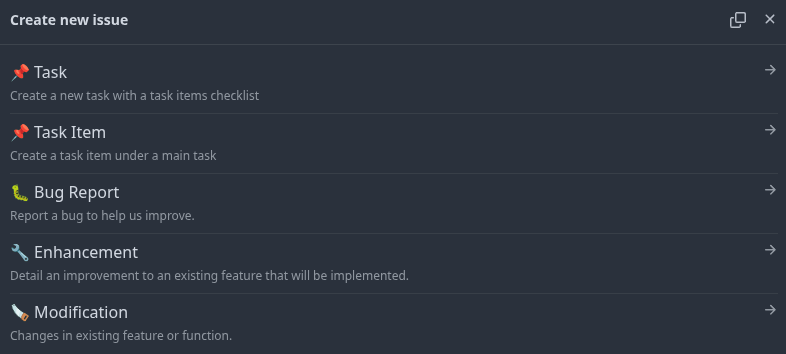

# 🚀 Dockerized VILT

A modern full-stack Laravel 12 application using:

- 🖼️ V - Vue + Vuetify
- 🧭 I - Inertia JS
- 🔗 L - Laravel
- 🎨 T - TypeScript

---


## 🌇 Overview
This setup is intended for development purposes with the use of docker. (Dockerized production setup coming soon)


## 📦 Getting Started

### 1. Clone the repository

```bash
git clone https://github.com/dlastnoel/vilt.git <folder-name>
cd <folder-name>
```

### 2. Environment Setup
```bash
cp .env.development.example .env
```

### 3. Running with Docker Development Environment
**NOTE**: Docker Engine must be installed and configured via WSL2 or a native Linux OS. The docker file also assumes that MySQL is installed within the operating system. Use the IP address instead of localhost when assigning connection values to the database.

* Change working directory to point with *docker-compose.yml*
```bash
cd docker/dev
```

* For 1st run, build the containers
```bash
docker compose build
```

* Run the containers
``` bash
docker compose up -d
```

* Work with the app (dev container)
```bash
docker exec -it app-dev sh
```


### 4. Installation
**NOTE:** The app (dev container) will be the execution point of all dev-related commands.

```bash
composer install
npm install
php artisan key:generate
```

### 5. Running in browser
Run with localhost as usual, 127.0.0.1:8000

## 🐋 Configuring with Docker

* Port 8000 and 5173 is intended for exposing the docker container. Change port if 8000 is in within the operating system. These can be found in the *docker-compose.yml*


```
build:
    args:
        # User and Group Identifier
        # Privilege and permissions to user
        - UID=${UID:-1000}
        - GID=${GID:-1000}

    dockerfile: ./dockerfiles/server.dockerfile
ports:
    - 8000:80


build:
    args:
        # User and Group Identifier
        # Privilege and permissions to user
        - UID=${UID:-1000}
        - GID=${GID:-1000}

    dockerfile: ./dockerfiles/app.dockerfile
volumes:
    # Marked as delegated for chunking (performance)
    - ./../../:/var/www/html:delegated
ports:
    # Expose vite port when running npm run dev (development purposes)
    - 5173:5173
```

* Also check the ***vite.config.ts*** and make sure these are enabled:
```bash
server: {
    hmr: {
        host: 'localhost',
    },
    port: 5173,
    host: true,
}
```


## Creating Issues in Repository
* Blank issues are disabled. Kindly use the appropriate template in writing issues.


